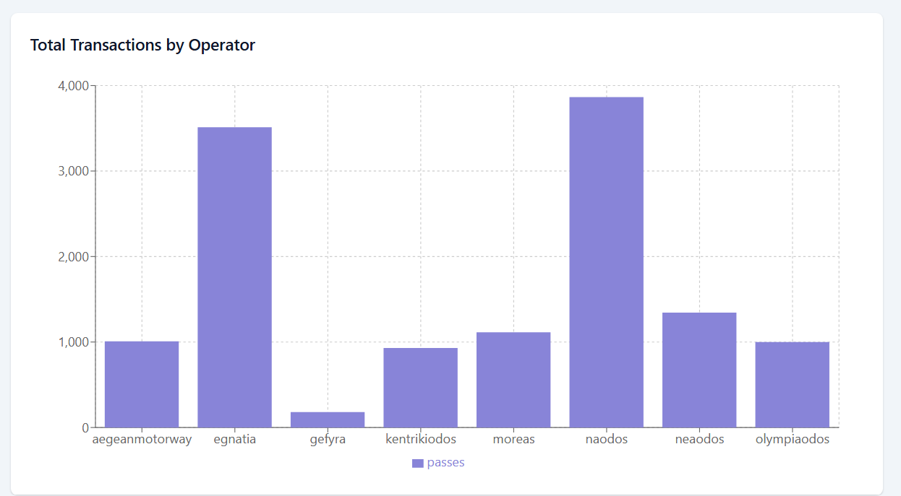

# InterPayToll 🛣️

[](https://www.postgresql.org/)
[](https://opensource.org/licenses/MIT)

## Overview 📋

**InterPayToll** is a comprehensive toll interoperability and analytics system designed for highways. The project facilitates financial reconciliation of debts between toll operators due to cross-system vehicle transits and provides advanced analytics services.

## Tech Stack 🛠️

Our application is built on the **PERN** stack:

- **PostgreSQL**: Open-source ORDBMS supporting both SQL and JSON querying
- **Express.js**: Fast, unopinionated web framework for Node.js
- **React**: JavaScript library for building dynamic user interfaces
- **Node.js**: JavaScript runtime for server-side applications

## Prerequisites ✅

1. Install and set up all PERN stack components
2. Create two PostgreSQL databases:
   - `interpaytoll` (main database)
   - `interpay_test` (testing database)

## Installation & Setup 🚀

### 1. Clone the Repository

```bash
git clone [your-repository-url]
```

### 2. Configure Environment

Navigate to `back-end` directory and create `.env` file:

```env
# Server Configuration
PORT=9115
NODE_ENV=development

# Database Configuration
DB_USER=<yourusername>
DB_HOST=localhost
DB_NAME=interpaytoll
DB_PASSWORD=<yourpassword>
DB_PORT=5432

# Authentication
JWT_SECRET=your_jwt_secret_here

# Testing
TEST_DB_NAME=interpay_test
```

### 3. Install Dependencies

Choose your operating system:

**Windows:**

```bash
npm install --prefix front-end && npm install --prefix back-end && npm install --prefix cli-client
```

**UNIX:**

```bash
npm install --prefix front-end & npm install --prefix back-end & npm install --prefix cli-client
```

> **Note**: If you encounter issues, run `npm install` manually in each directory.

### 4. Initialize Database

```bash
cd back-end
node src/scripts/initEmptyDb.js    # Creates schema and initializes user accounts
```

### 5. Start the Application

**Backend:**

```bash
cd back-end
node --watch src/server.js
```

> **Note**: Run the postman collection if you have access to it.

**CLI Setup:**

```bash
cd cli-client/testing
chmod +x pretty42.sh
./pretty42.sh
```

**Frontend:**

```bash
cd front-end
npm run dev
```

### 6. Testing

**Backend Tests:**

```bash
cd back-end/__tests__
npm test
```

**CLI Tests:**

```bash
cd cli-client/__tests__
npm test
```

## Screenshots 📸

<p align="center">
  <br>
  <br>
  <br>
  
  
  <br>
  
</p>

## Important Notes ⚠️

- The frontend UI is designed for operators only. When logging in, ensure your username matches an operator account, otherwise features like charts won't be rendered.
- Administrative functions are accessible through the CLI interface only.
